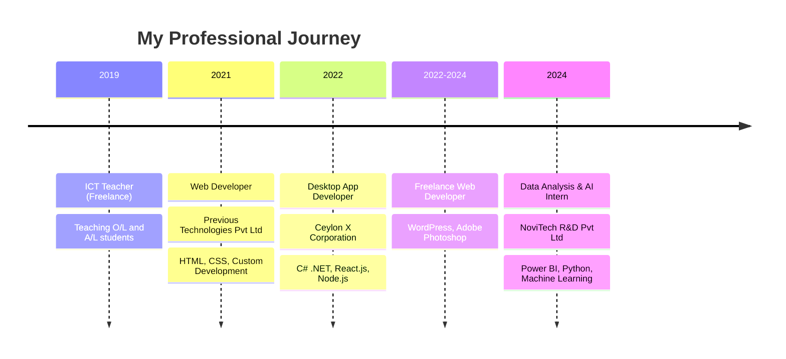

# 💫 Hey there! I'm Mohamed Ajmal 
### 🚀 Data Scientist | AI Enthusiast | Full-Stack Developer

  

---

### 🎯 About Me

🔭 **Currently Working On:**  
• 🏏 **IPL 2025 Winner Prediction System** - Advanced ML models to predict IPL champions  
• 📚 **Nissanka National School Library Management System** - Complete digital solution for school library operations

🌱 **Learning & Growing:**  
• Advanced Machine Learning & Deep Learning  
• Cloud Computing & MLOps  
• Data Engineering & Big Data Analytics

💼 **Professional Experience:**  
• Data Analysis & AI Intern at NoviTech R&D  
• Full-Stack Web Developer (Freelance)  
• Desktop Application Developer at Ceylon X Corporation

🎓 **Education:**  
• BSc (Hons) Data Science - NSBM Green University  
• Member of Computer Society of Sri Lanka

 

---

## 🛠️ Tech Arsenal

### 💻 Programming Languages

### 🤖 AI & Data Science

### 🌐 Web Technologies

### 📊 Data Visualization & BI

### 🎨 Design Tools

---

## 🌟 Featured Projects

### 🏏 IPL 2025 Winner Prediction System

**Advanced machine learning system to predict IPL 2025 championship winner**
- 🔥 **Tech Stack:** Python, scikit-learn, TensorFlow, Pandas, NumPy
- 📊 **Features:** Historical data analysis, player performance metrics, team statistics
- 🎯 **Goal:** Achieve 85%+ prediction accuracy using ensemble methods

---

### 📚 Nissanka National School Library Management System

**Complete digital solution for school library operations**
- 💻 **Tech Stack:** React.js, Node.js, MongoDB, Express.js
- 📋 **Features:** Book management, student records, borrowing system, automated notifications
- 🎨 **UI/UX:** Modern, intuitive interface designed for ease of use

---

## 📈 GitHub Analytics

  

  

---

## 🏆 Achievements & Leadership

| 🎖️ Role | 🏢 Organization | 📅 Period |
|---------|-----------------|-----------|
| **Project Manager** | STEMUP NSBM | 2024-Present |
| **Member** | NSBM ISACA Student Group | 2023 |
| **Member** | Generation ALPHA Sri Lanka | 2023 |
| **Student Member** | Computer Society of Sri Lanka | 2023-Present |

---

## 💡 Professional Journey

---

## 🎓 Education & Certifications

| 🎓 Qualification | 🏫 Institution | 📅 Year |
|------------------|-----------------|---------|
| **BSc (Hons) Data Science** | NSBM Green University | 2022-Present |
| **Adv. Certificate in English** | LCL Campus | 2022 |
| **Diploma in IT** | NICD | 2019-2020 |
| **G.C.E. A Level (Technology)** | Berrewaerts College, Kandy | 2016-2019 |

---

## 📫 Let's Connect!

---

### 🌟 "Turning Data into Insights, Ideas into Reality" 🌟

---

  
**⭐ Don't forget to star my repositories if you find them useful! ⭐**

